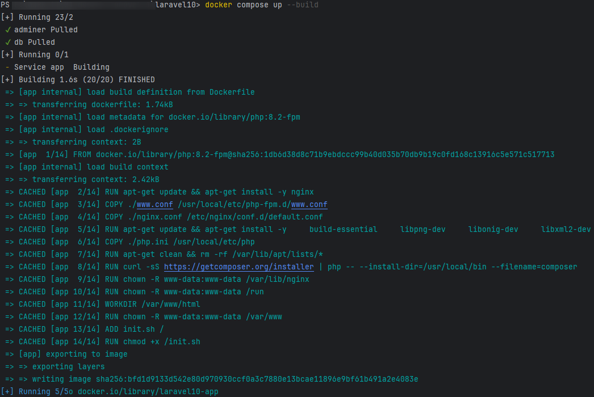
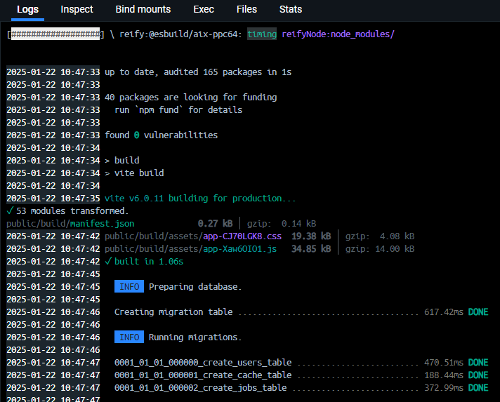
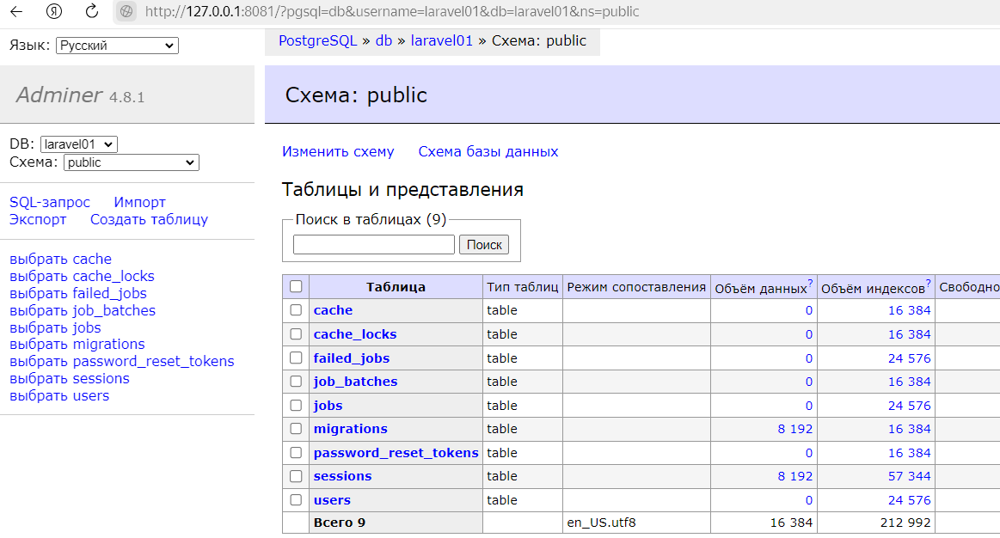
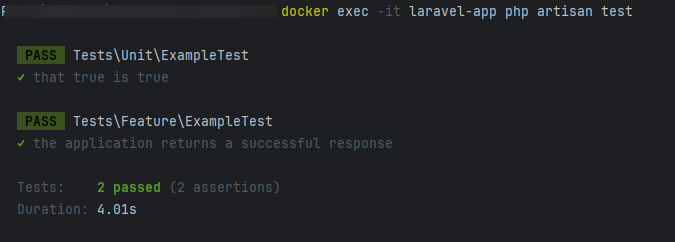
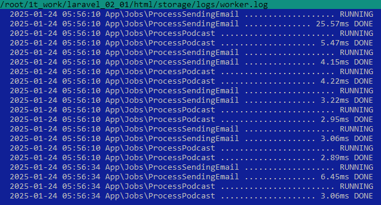

<details>
  <summary>1. Задание 01: Создание docker-compose под laravel + PostgreSQL + adminer</summary>

    ### 1. Задание 01: Создание docker-compose под laravel + PostgreSQL + adminer
    
    
    ## Требования к заданию:
    
    Контейнер с Laravel (https://laravel.com/docs/11.x) приложением:
    
    * Создать Dockerfile для Laravel приложения,
    
      * Включить необходимые зависимости и настройки для запуска Laravel,
      * внутри контейнера должны быть nginx, php-fpm (8.2+), laravel 11.x
      * Контейнер PostgreSQL:
    
        * Поднять контейнер с PostgreSQL 16
        * Настроить базу данных, должна быть создана база данных с произвольным именем и пользователем
        * с произвольным именем и парольным доступом к бд (он должен быть без привилегий суперпользователя, должен видеть только свою базу данных и уметь читать и писать в нее).
      * Контейнер adminer:
    
        * Поднять контейнер с adminer.
        * Из веб дашборда adminer (должен быть доступен из браузера по произвольному порту), должна быть возможность подключаться к базе данных
      * Запуск приложения:
    
        * Приложение должно быть доступно на порту 8080.
        * Должны работать миграции, тесты и авторизация/регистрация (используем встроенные в laravel)
        * Важно, что все необходимые зависимости должны устанавливаться внутри контейнеров, и проект должен быть работоспособным после старта контейнеров.
      * Результат:
    
        * Ссылка на исходный код, который должен быть размещен в любом публичном vcs например https://github.com/.

</details>

<details>
  <summary>2. Задание 01.1: Правки</summary>

    ## Добавить исходный код приложения в репозиторий
    
    ## nginx + php должны работать в одном контейнере
    
    ## После запуска контейнеров приложение должно быть полностью работоспособным
    
    ## Реализация
    
    1. В папке `html` должен быть расположен Laravelx11 (в репозитарий включен)
       2. В корне `docker compose up -d` - запуск
          
       3. Логи контейнера
          
       4. Запуск Laravel в браузере `http://127.0.0.1:8080`
          
       5. Запуск Adminer в браузере `http://127.0.0.1:8081`
          
       6. Тесты `docker exec -it laravel-app php artisan test`
          
    

</details>

# 3. Задание 02: alpine linux + supervisor (php+nginx) + user + очереди в laravel + мультистейдж сборку

## 3.1. Перевести контейнер с php+nginx на alpine linux: в учебных целях НЕ будем использовать оф образ от php, а используем голый [alpine linux](https://hub.docker.com/_/alpine/tags)
- [x] Сделано

## 3.2. Запускать php и nginx из [supervisor](http://supervisord.org/)
- [x] Сделано

## 3.3. php и nginx должны работать от произвольного пользователя, например, с именем vivek, который не должен обладать привилегиями суперпользователя
- [x] Сделано

## 3.4. Нужно запустить [очереди в laravel](https://laravel.com/docs/11.x/queues) в этом контейнере (что-то выполнять не нужно в очереди, достаточно того чтобы был запущен слушатель)
- [x] Сделано
  * `php artisan make:job ProcessSendingEmail`
  * Открываем созданный файл app/Jobs/ProcessSendingEmail.php и обновляем функцию handle
  * ```    
    public function handle(User $user)
    {
        Log::debug('ProcessSendingEmail:'.date('H:i:s d.m.Y'));                                                       
    }
    ```
  * Сейчас наш обработчик получает модель пользователя и отсылает ему письмо с помощью стандартного пакета Mail в Laravel
  * Отправить новое событие в очередь, `routes/web.php`:
  * ```
    use App\Jobs\ProcessSendingEmail;
    use App\Jobs\ProcessPodcast;
    use Illuminate\Support\Facades\Route;
    
    Route::get('/', function () {
       ProcessSendingEmail::dispatch();
       ProcessPodcast::dispatch();
       return view('welcome');
    });
    ```
  * После вызова функции dispatch новое событие тут же улетит в нашу очередь, а нам лишь остаётся запустить обработчик нашей очереди и ждать, когда письмо отправится пользователю.
  * Запускаем обработчик всех событий в консоли командой:
  * `php artisan queue:work`
  * В данном случаем обработчик запущен в `docker/supervisord.ini`
  * ```
    [program:laravel-worker]
    process_name=%(program_name)s_%(process_num)02d
    command=php /var/www/html/artisan queue:work
    autostart=true
    autorestart=true
    stopasgroup=true
    killasgroup=true
    numprocs=1
    redirect_stderr=true
    stdout_logfile=/var/www/html/storage/logs/worker.log
    stopwaitsecs=3600
    stdout_logfile_maxbytes=5MB
    ```
  * После запуска обработчика все наши события будут поочередно обрабатываться, и если у нас в очереди было 100 писем на отправку, то последнее письмо явно отправится не скоро и будет примерно, как на первой картинке, когда все ждут в очереди.
  * 
  * 

## 3.5. Добавить мультистейдж сборку приложения
- [ ] В работе

* Изучение:
  * https://selectel.ru/blog/docker-security-2/
  * Механизм мультистейдж (multi-stage) позволяет избавиться от всего лишнего и собрать итоговый образ, исключающий build-зависимости и выборочно копирующий только необходимые артефакты. В итоге мы получаем временные образы и финальный, а поверхность атаки значительно уменьшается. Также сам образ будет меньше — значит, сокращается время, которое нужно на его загрузку.

* Практически каждая инструкция в Dockerfile добавляет отдельный слой и вам необходимо очистить этот слой от всех лишних артефактов, перед тем как добавить новый слой. Поэтому чтобы создать действительно эффективный Dockerfile раньше вам традиционно предлагали использовать скрипты и другую логику, чтобы поддерживать минимально возможный размер слоя. Обычной практикой было использовалось несколько Dockerfile в зависимости от целей сборки образа — один файл для DEVELOPMENT с определенным набором средства для отладки, профайлинга и всего остального и другой образ, гораздо меньшего размера для развертывания приложения на STAGING или PRODUCTION, с набором компонентов, необходимых для работы приложения.
0. https://www.itsumma.ru/blog/docker_image, https://dev.to/titasgailius/multi-stage-docker-builds-for-laravel-c86
1. указать исключения: что не надо тащить в контекст. Для этого положим в проект файл .dockerignore и укажем, что не нужно для сборки