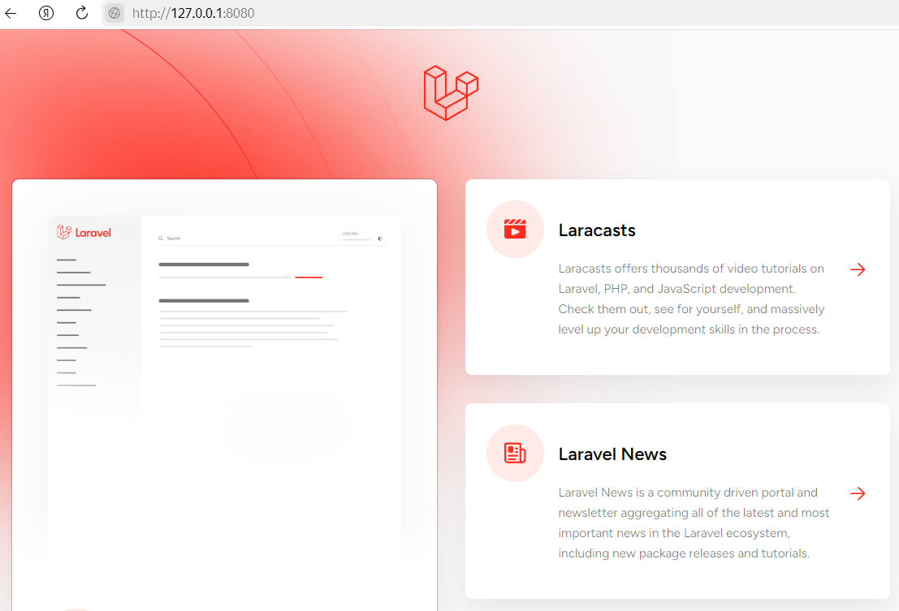

  
1. Задание 01: Создание docker-compose под laravel + PostgreSQL + adminer

    ### 1. Задание 01: Создание docker-compose под laravel + PostgreSQL + adminer
    
    
    ## Требования к заданию:
    
    Контейнер с Laravel (https://laravel.com/docs/11.x) приложением:
    
    * Создать Dockerfile для Laravel приложения,
    
      * Включить необходимые зависимости и настройки для запуска Laravel,
      * внутри контейнера должны быть nginx, php-fpm (8.2+), laravel 11.x
      * Контейнер PostgreSQL:
    
        * Поднять контейнер с PostgreSQL 16
        * Настроить базу данных, должна быть создана база данных с произвольным именем и пользователем
        * с произвольным именем и парольным доступом к бд (он должен быть без привилегий суперпользователя, должен видеть только свою базу данных и уметь читать и писать в нее).
      * Контейнер adminer:
    
        * Поднять контейнер с adminer.
        * Из веб дашборда adminer (должен быть доступен из браузера по произвольному порту), должна быть возможность подключаться к базе данных
      * Запуск приложения:
    
        * Приложение должно быть доступно на порту 8080.
        * Должны работать миграции, тесты и авторизация/регистрация (используем встроенные в laravel)
        * Важно, что все необходимые зависимости должны устанавливаться внутри контейнеров, и проект должен быть работоспособным после старта контейнеров.
      * Результат:
    
        * Ссылка на исходный код, который должен быть размещен в любом публичном vcs например https://github.com/.

  
2. Задание 01.1: Правки

    ## Добавить исходный код приложения в репозиторий
    
    ## nginx + php должны работать в одном контейнере
    
    ## После запуска контейнеров приложение должно быть полностью работоспособным
    
    ## Реализация
    
    1. В папке `html` должен быть расположен Laravelx11 (в репозитарий включен)
       2. В корне `docker compose up -d` - запуск
          
       3. Логи контейнера
          
       4. Запуск Laravel в браузере `http://127.0.0.1:8080`
          
       5. Запуск Adminer в браузере `http://127.0.0.1:8081`
          
       6. Тесты `docker exec -it laravel-app php artisan test`
          
    

# 3. Задание 02: alpine linux + supervisor (php+nginx) + user + очереди в laravel + мультистейдж сборку

## 3.1. Перевести контейнер с php+nginx на alpine linux: в учебных целях НЕ будем использовать оф образ от php, а используем голый [alpine linux](https://hub.docker.com/_/alpine/tags)
- [x] Сделано

## 3.2. Запускать php и nginx из [supervisor](http://supervisord.org/)
- [x] Сделано

## 3.3. php и nginx должны работать от произвольного пользователя, например, с именем vivek, который не должен обладать привилегиями суперпользователя
- [ ] В работе

## 3.4. Нужно запустить [очереди в laravel](https://laravel.com/docs/11.x/queues) в этом контейнере  (что-то выполнять не нужно в очереди, достаточно того чтобы был запущен слушатель)
- [ ] В работе

## 3.5. Добавить мультистейдж сборку приложения
- [ ] В работе